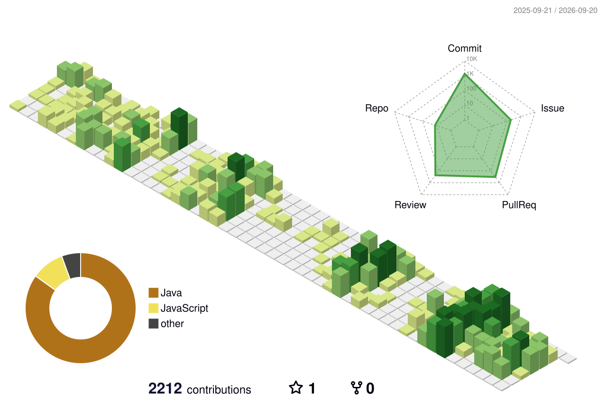

<h1 align="center">Hi, I'm Eunwoo Lee 👋</h1>

  <i>
    Backend developer who enjoys building services with care 
    and understanding how they work beyond the code.
  </i>

  <i>
    I enjoy solving problems with my team, learning through challenges, 
    and turning ideas into reliable services.
  </i>

  
  
  

 

## 🌱 About

- 🎓 B.S. in Computer Engineering, Sungshin Women's University · 2026
- 💻 Backend Development · Cloud Infrastructure · DevOps
- 🌏 UMC · GDGoC · WFK ICT Volunteer

 

## 🛠 Tech Stack

**Language & Framework**

   

 

**Database**

  

 

**Infra & Tools**

     

 

**AI & Integration**

  

 
 

## 🚀 Featured Projects

<h3 align="center">💌 dear.e</h3>

  <b>Backend</b> · 2026.01 ~ 2026.08

  감정을 저장하는 디지털 편지함

  

  
  
  
  
  
  

  
  

 
 

<h3 align="center">✉️ TodayEng</h3>

  <b>Backend · Infrastructure</b> · 2026.07 ~ 2026.08

  오늘의 나를 아는 질문으로 시작하는 영어 스피킹

  

  
  
  
  
  
  

  
  

 
 

<h3 align="center">🎹 MuseReview</h3>

  <b>Backend</b> · 2026.06 ~ 2026.08

  나의 연주 습관과 화성학적 의도를 정밀 분석하여, 독학 중에도 레슨을 받는 듯한 성장을 경험하게 돕는 AI 음악 멘토링 플랫폼

  

  
  
  
  
  
  

  
  

 
 

## 📊 GitHub & Velog

  
  

 
 

## 📫 Contact

  
  
  

