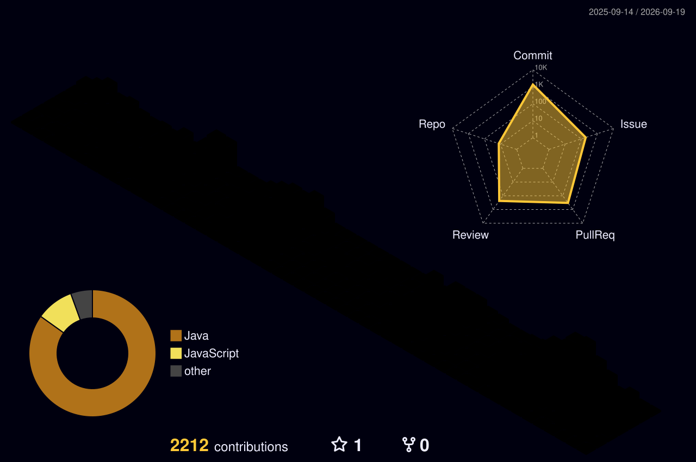

# ⋆｡˚ ☁︎ Hi, I'm ownue ☁︎ ˚｡⋆

Backend developer who enjoys building services  
and figuring out how they work beyond the code. 🌱

 

## 🐈 About Me

🎓 Sungshin Women's University · Computer Engineering '23  
💻 I enjoy building backend services and APIs  
☁️ Interested in Cloud Infrastructure & DevOps  
🧩 I like thinking about authentication, data flow, and service architecture

 

## 🌷 What I Like

`Backend Development` · `API Design` · `OAuth & Authentication`  
`Cloud Infrastructure` · `Distributed Systems` · `DevOps`

 

## 🧶 Tech Stack

### ☕ Backend

### 🗄 Data

### ☁️ Infra & DevOps

### 🛠 Tools

 
 

## 🍀 These Days

🛠️ **Building** · Backend APIs & Services  
☁️ **Learning** · Cloud Infrastructure & DevOps  
💭 **Interested in** · Authentication · Distributed Systems · Service Architecture

 

## 🌈 GitHub Activity

 

⋆｡ﾟ✶° Thanks for visiting °✶｡ﾟ⋆

